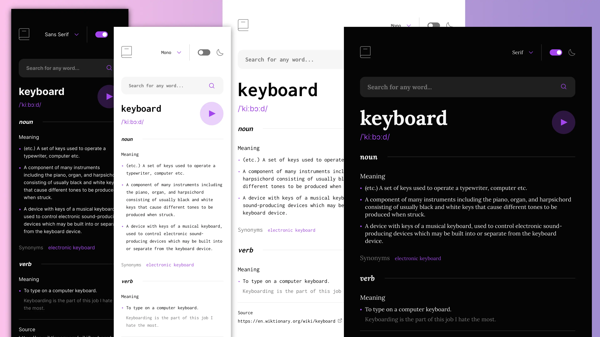

# Dictionary Web App - Frontend Mentor Challenge


It appears that the project you're trying to run uses Vite as its build tool and development server. Here are the steps to run the `fem-dictionary-web-app` project on your localhost:

1. **Clone the Repository:**
   If you haven't already, clone the repository as mentioned earlier:

   ```sh
   git clone https://github.com/developerrahulofficial/dictionary-app.git
   ```

2. **Navigate to the Project Directory:**
   Move into the project directory:

   ```sh
   cd dictionary-app
   ```

3. **Install Dependencies:**
   Install the project's dependencies using npm:

   ```sh
   npm install
   ```

4. **Run the Development Server:**
   To start the development server, use the following command:

   ```sh
   npm start
   ```

   This command will run Vite's development server, and the application will be accessible at a local URL, usually `http://localhost:8080` or a similar port.

   Alternatively, you can use the specific `preview` script:

   ```sh
   npm run 
   ```

   This will also start the development server.

5. **Access the Application:**
   Open your web browser and navigate to the local URL where the development server is running (e.g., `http://localhost:8080`). You should be able to see and interact with the web application.

Keep in mind that the available scripts and their functionality are defined in the project's `package.json` file. The above instructions assume that you have Node.js and npm installed on your system.

If you encounter any issues during this process, please refer to the project's documentation or README for troubleshooting steps specific to the `fem-dictionary-web-app`.
